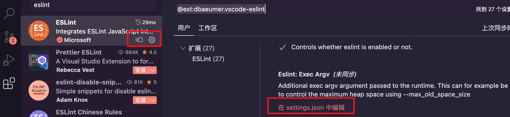
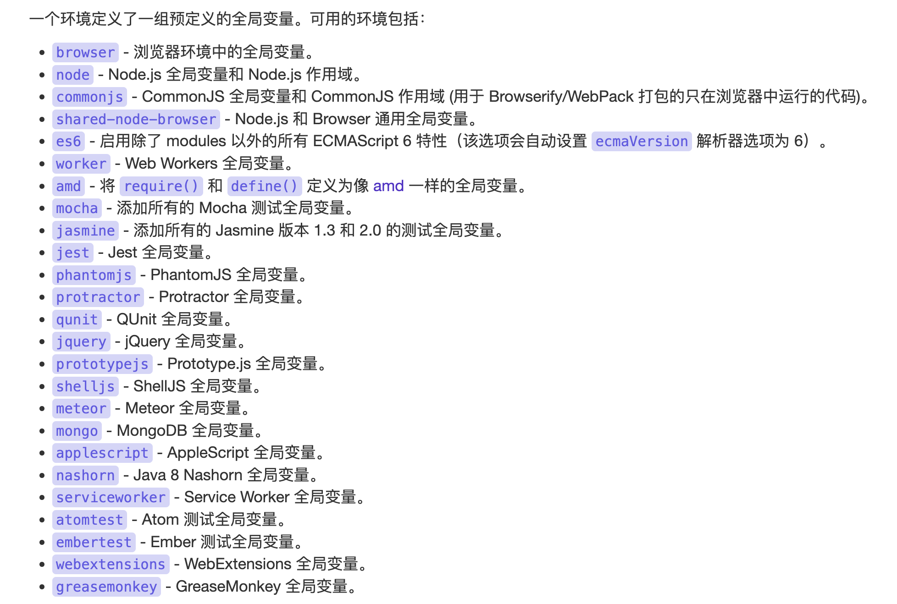

<!-- START doctoc generated TOC please keep comment here to allow auto update -->
<!-- DON'T EDIT THIS SECTION, INSTEAD RE-RUN doctoc TO UPDATE -->
**Table of Contents**  *generated with [DocToc](https://github.com/thlorenz/doctoc)*

* [管理系统组成](#%E7%AE%A1%E7%90%86%E7%B3%BB%E7%BB%9F%E7%BB%84%E6%88%90)
* [登陆](#%E7%99%BB%E9%99%86)
* [权限](#%E6%9D%83%E9%99%90)
* [代理](#%E4%BB%A3%E7%90%86)
* [开发](#%E5%BC%80%E5%8F%91)
* [框架](#%E6%A1%86%E6%9E%B6)
* [构建工具](#%E6%9E%84%E5%BB%BA%E5%B7%A5%E5%85%B7)
* [代码规范](#%E4%BB%A3%E7%A0%81%E8%A7%84%E8%8C%83)
  + [eslint+prettier 的使用，如果想直接看如何配置 `.eslintrc.js` 和vscode的 `settings.json` 。可直接前往当前章节末尾查看“”](#eslintprettier-%E7%9A%84%E4%BD%BF%E7%94%A8%E5%A6%82%E6%9E%9C%E6%83%B3%E7%9B%B4%E6%8E%A5%E7%9C%8B%E5%A6%82%E4%BD%95%E9%85%8D%E7%BD%AE-eslintrcjs-%E5%92%8Cvscode%E7%9A%84-settingsjson-%E5%8F%AF%E7%9B%B4%E6%8E%A5%E5%89%8D%E5%BE%80%E5%BD%93%E5%89%8D%E7%AB%A0%E8%8A%82%E6%9C%AB%E5%B0%BE%E6%9F%A5%E7%9C%8B)
    - [vscode如何针对vue2项目使用eslint？](#vscode%E5%A6%82%E4%BD%95%E9%92%88%E5%AF%B9vue2%E9%A1%B9%E7%9B%AE%E4%BD%BF%E7%94%A8eslint)
    - [为什么要用prettier？以及如何使用？](#%E4%B8%BA%E4%BB%80%E4%B9%88%E8%A6%81%E7%94%A8prettier%E4%BB%A5%E5%8F%8A%E5%A6%82%E4%BD%95%E4%BD%BF%E7%94%A8)
    - [eslint 和prettier同时使用造成的规则冲突及解决办法](#eslint-%E5%92%8Cprettier%E5%90%8C%E6%97%B6%E4%BD%BF%E7%94%A8%E9%80%A0%E6%88%90%E7%9A%84%E8%A7%84%E5%88%99%E5%86%B2%E7%AA%81%E5%8F%8A%E8%A7%A3%E5%86%B3%E5%8A%9E%E6%B3%95)
    - [`.eslintrc.js` 和vscode 中 `settings.json` 配置示例](#eslintrcjs-%E5%92%8Cvscode-%E4%B8%AD-settingsjson-%E9%85%8D%E7%BD%AE%E7%A4%BA%E4%BE%8B)
  + [git提交前eslint校验](#git%E6%8F%90%E4%BA%A4%E5%89%8Deslint%E6%A0%A1%E9%AA%8C)
* [测试](#%E6%B5%8B%E8%AF%95)
* [自动化部署](#%E8%87%AA%E5%8A%A8%E5%8C%96%E9%83%A8%E7%BD%B2)
* [服务质量维护](#%E6%9C%8D%E5%8A%A1%E8%B4%A8%E9%87%8F%E7%BB%B4%E6%8A%A4)
* [性能监控](#%E6%80%A7%E8%83%BD%E7%9B%91%E6%8E%A7)

<!-- END doctoc generated TOC please keep comment here to allow auto update -->

# 管理系统组成

# 登陆

SS0重定向

# 权限

通用权限系统设定

# 代理

rpc后台多服务，前端nginx代理

# 开发

开发工具配置

# 框架

# 构建工具

# 代码规范

## eslint+prettier 的使用，如果想直接看如何配置 `.eslintrc.js` 和vscode的 `settings.json` 。可直接前往章节[配置示例](#eslintrcjs-%E5%92%8Cvscode-%E4%B8%AD-settingsjson-%E9%85%8D%E7%BD%AE%E7%A4%BA%E4%BE%8B)查看

eslint是用来检查代码中是否有没有使用的变量，使用用了不符合规范的写法。可以通过一套规则检查代码不符合规范的部分来实现整个项目代码规范的统一。

### vscode如何针对vue2项目使用eslint？

1、首先需要在vscode中安装eslint插件。可以顺便打开vscode的配置文件settings.json，检查其中的 `eslint.enable` 是不是被不小心设置成了false，这个选项默认情况是true。

```
{
    "eslint.enable": false, // 关闭eslint检查，
 }

```

还有一点就是需要在vscode开启保存时自动检查并修复的功能，打开vscode的 `ettings.json` 配置文件。然后配置以下配置

```
{
	"editor.codeActionsOnSave": {
        "source.fixAll.eslint": true
    }
}
```

（点击vscode插件列表的小齿轮也能进行设置）



  

2、后在项目中安装eslint

```
npm i eslint -D
```

3、在项目的根目录中新建eslint的配置文件（也可以package.json中的 `eslintConfig` 字段下配置，效果和配置文件一样的）。配置文件的格式可以是 `.eslintrc.js` , `.eslintrc.json` , `.eslintrc.yaml` . 下面以在vue2项目使用 `.eslintrc.js` 举例

先安装下三个插件 `@babel/eslint-plugin` , `eslint-config-prettier` , `eslint-plugin-vue` , 后面会说到具体作用

```
npm i @babel/eslint-plugin eslint-plugin-vue  eslint-config-prettier -D
```

```js
//.eslintrc.js
//支持对vue2文件进行格式校验的最基础配置就类似下面
module.exports = {
    env: {
        browser: true,
        es6: true,
        node: true,
    }, //
    parser: "@babel/eslint-parser",
    parserOptions: {
        sourceType: "module",
    },
    extends: ["eslint:recommended", "plugin:vue/essential", "prettier"],
    rules: {
        camelcase: "warn",
        quotes: ["error", "single"],
    },
};
```

> env：eslint会对全局变量进行校验，通过env可以对全局变量进行定义



> parser : 定义用什么解析器来解析js文件。这里，如果不设置的话默认用的是eslint的 `Espree` 。这里选比较常用的babel的解析器。能更好的配合babel

> extends: 继承其他已经配置好的规则。 `eslint:recommended` 是eslint包装好的核心规则，只要继承它就能使用社区已经总结定义好的一些规则配置。这个一般是必须的， `plugin:vue/essential` 是来与于插件 `eslint-plugin-vue` 中的配置，其定义了对vue2文件的解析，和对vue2一些语法的规则。（如果项目用的是vue3，可以直接使用插件 `eslint-plugin-vue` 中携带的另一套配置 `plugin:vue/vue3-recommended` ）。 `prettier` 是来自于插件 `eslint-config-prettier` 中携带的配置，这个主要用于把eslint中的那部分和vscode中prettier插件格式化规则冲突的部分给关闭，关闭的都是些和格式化相关的非必要规则。注意关闭的是eslint中的规则，而不是vscode中prettier插件的规则

> rules : 主要用来描述具体的规则，例如能不能使用单引号，缩进用多少这类。具体可以去[eslint规则页面](https://eslint.bootcss.com/docs/rules/)查看，如需调整按照官网上的名称进行更改即可

### 为什么要用prettier？以及如何使用？

 prettier不仅能格式化js，也能格式化html，json，css等许多类型的文件。为了方便我们处理各种类型的文件装上prettier插件能很好的帮助我们进行格式化。也顺带对js文件进行格式化。

vscode中使用prettier对代码进行格式化只需要安装 `Prettier - Code formatter` 插件。这样我们在编辑文件时鼠标右键就能选择使用prettier进行格式化


  

如果想要保存文件时自动使用prettier进行格式化的话需要开启vscode的开启代码保存时进行格式化的设置。然后将默认的格式化方式设置为prettier。具体的 `settings.json` 中对应的配置如下。当然默认的格式化工具可以通过单机鼠标右键->使用... 格式化文档 选项进行更改

```json
{
	"editor.formatOnSave": true, // 开启保存文件自动格式化代码
	"editor.defaultFormatter": "esbenp.prettier-vscode", // 默认的代码格式化工具
}
```

### eslint 和prettier同时使用造成的规则冲突及解决办法

因为eslint在保存时能够修复代码，同时prettier在保存时也会对代码进行格式化。两者的格式化规则中存在小部分冲突的规则。解决的办法有两个，一个是使用 `eslint-config-prettier` 包，该包能够忽略掉eslint中那些和prettier冲突的规则。另一个是使用是使用 `eslint-plugin-prettier` 包，这个也能忽略掉冲突的规则，不过如果代码的格式不满足prettier的规则的话是通过eslint暴漏出来。这里我就用前者举例

```
npm i eslint-config-prettier -D
```

然后在 `.eslintrc.js` 配置文件中使用该包中携带的配置 `prettier`

```
//.eslintrc.js
{
	  extends: ["eslint:recommended", "plugin:vue/essential","prettier"]
}
```

### `.eslintrc.js` 和vscode 中 `settings.json` 配置示例

```
npm i @babel/eslint-plugin eslint-plugin-vue eslint-config-prettier eslint -D
```

```
//.eslintrc.js
module.exports = {
    env: {
        browser: true,
        es6: true,
        node: true,
    }, 
    parser: "@babel/eslint-parser",
    parserOptions: {
        sourceType: "module",
    },
    extends: ["eslint:recommended", "plugin:vue/essential", "prettier"],
    rules: {
        camelcase: "warn",
        quotes: ["error", "single"],
    },
};
```

```
//settings.json
{
	"editor.formatOnSave": true, 
	"editor.defaultFormatter": "esbenp.prettier-vscode",
	"eslint.enable": true,
	"editor.codeActionsOnSave": {
        "source.fixAll.eslint": true
  },
	
}
```

## git提交前eslint校验

# 测试

测试流程，分环境部署

# 自动化部署

cli、shell脚本、云服务器

# 服务质量维护

负载均衡、限流熔断
进程守护工具 Daemontools

# 性能监控

性能监控，数据埋点，指标统计
