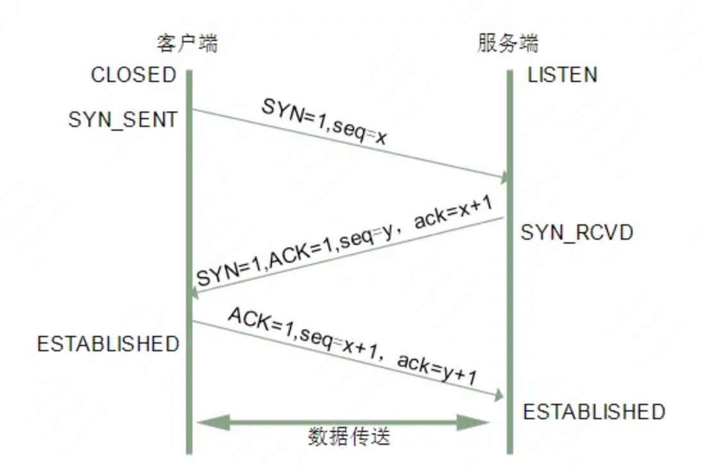
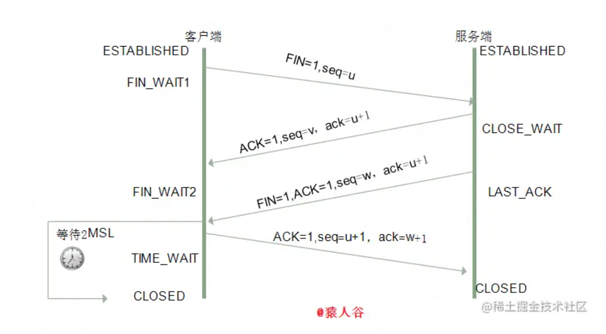
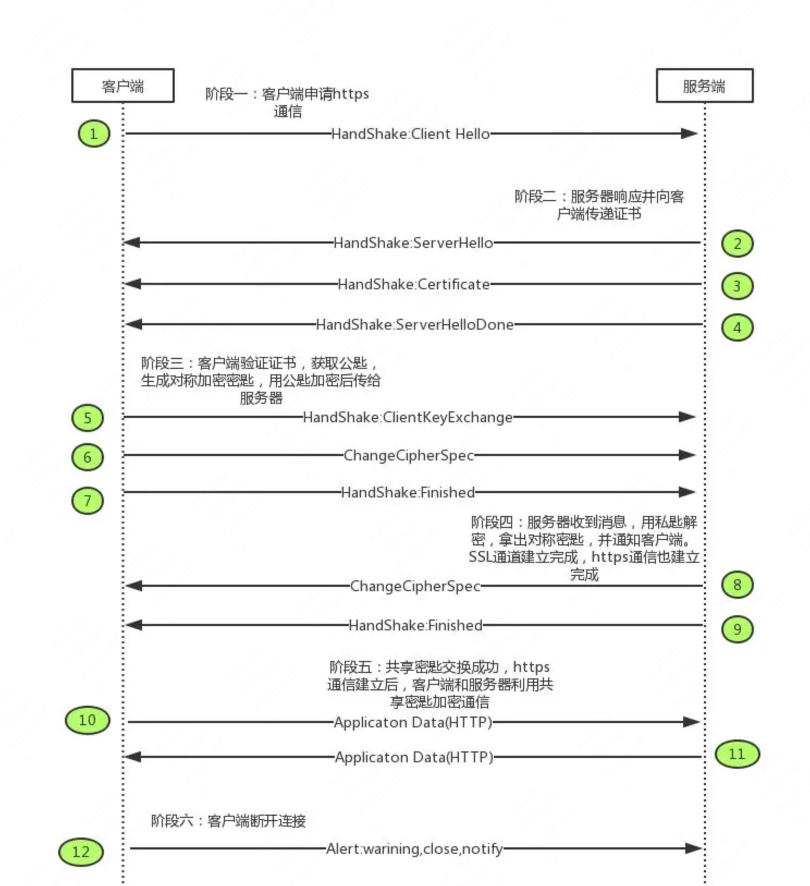
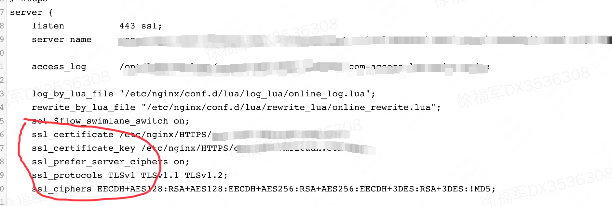

# http

http 是处于tcp/ip网络模型（网络接口：针对不同物理设备和网络之间的交互，网络层：数据传输，路径选择等，传输层：数据传输，数据纠错，tcp或udp等）中的应用层的一种传输协议。该协议在传输的过程中是无状态的，明文的。很容就能对传输内容进行拦截和篡改。

## 建立连接的三次握手

用户端和服务端建立起tcp链接需要三次握手，通过发送三个包来确认用户端和服务端的接收和发送能力均是正常的。



  
* 第一步客户端向服务端发送一个syn报文，请求和服务端建立连接。客户端进入`SYN_SEND`状态，
* 服务端接收到包后就服务端能确认客户端的发送能力正常，这时服务端针对该请求进行响应，发送第二个包（syn和ack）到客户端上，此时服务端出于`SYN_RCVD`状态
* 客户端接收到来自服务端的响应后客户端能确认服务端的发送和接收能力是正常的。此时客户端还需要向服务端发送最后一个包（ack）到服务端。告知服务端客户端的接收能力没问题。数据发出后客户端就处于了`ESTABLISHED`(确认)状态。
* 服务端接收到了客户端的最后一个包，这下服务端知道了客户端的接收能力没问题。服务端也将处于`ESTABLISHED`状态

## 为什么两次握手不行？

三次握手的主要目的是**确认客服端和服务端的发送和接收能力均是正常的。同时互相确认请求是正常的**。如果是两次握手，首先不光服务端无法确认客户端的接收能力正不正常，接收能力都不正常何必建立连接呢。另外如果是二次握手，在客户端第一次发送报文到服务端时，因为网络原因该请求延迟了，客户端又重新发送了一个并完成连接。一段时间后之前延迟的那个终于到了服务端，服务端收到后发送一个包到客户端上并将服务端状态设为 `ESTABLISHED` . 因为客户端已经建立了连接，所以忽略了该包。而服务端一直苦苦等着客户端给他发数据，其实客户端鸟都不鸟，直接用已经建立好的连接进行发送。这样服务端就多维护了一个连接造成资源浪费。

## 半连接队列以及syn攻击

因为建立起完整的连接需要两次完整的应答，在服务端向客户端发送了第二次数据后（ack/syn），服务端会持续等待客户端的回应（最后一次握手）。服务端将这些还没完成的连接维护在 `半连接队列` 中，而已经建立好的连接维护在 `连接队列` 中。而syn攻击就是针对半连接对列是有大小限制的，满了后其他新请求就不能继续了。要解决的方法有几种
* 缩短超时（SYN Timeout）时间
* 增加最大半连接数
* 过滤网关防护
* SYN cookies技术

## 断开连接的四次挥手

直观上来说，断开连接一个连接需要知道对方是否还有数据需要发送。所以四次动作才能完成一整个的连接断开



  
从图中可以清晰的看出，如果客户端想要断开了，
* 那么客户端会向服务端发送一条数据告诉服务端我已经没有数据要发送了，准备断开连接。此时客户端处于`FIN_WAIT1（终止等待1)`.
* 服务端收到该请求后告诉客户端说，“收到你的断开连接请求了，等我把最后的数据发送完再断开”. 此时服务端处于`CLOSE_WAIT`状态。
* 过了一会服务端数据发送完了，发送断开连接确认请求到客户端，告诉客户端服务端没有数据发送了，服务端即将断开连接。此时服务端处于`LAST_ACK`状态。
* 客户端收到服务端的最后一个请求后客户端知道了服务端已经可以关闭了，这时客户端开启倒计时（也就是`TIME_WAIT`状态）。2MSL等待结束后客户端就完成连接的断开。还有最后一个动作没完成，那就是客户端还需要最后一次请求告诉服务端我已经知道了服务端你那边可以关了。当这个请求到达服务端后服务端完成连接的关闭。

## 为什么断开连接时客户端的最后一次请求发出后需要等待一段时间才断开连接（2MSL等待）？

这都是因为请求在网络传输过程中是可能丢失的，如果最后一次请求没到服务端，那服务端就没法判断客户端到底有没有收到**服务端即将关闭连接的通知**。这样服务端就无法关闭连接。而存在一个等待时间，如果服务端规定时间内没收到确认请求，那服务端重新走第三步再次告诉客户端我要关闭连接了。直到成功为止

## 四次挥手的最后挥手的作用？只用三次行不行？

客户端最后一次向服务端发送的确认请求的作用在于向服务端表明**我已经收到了来自你（服务端）即将关闭连接的通知**。我稍后就会关闭连接了，总而言之，要关闭连接一定是要确认对方都没数据要发送了。三次是不行的。

# https

为了解决安全传输的需要所以有了https，https是http+SSL/TLS的简称。安全传输需要解决的问题就是三个
* 信息完整性确认
* 信息加密
* 身份认证，确认交流方是不是正确的

1. 为了解决第一个问题，需要在数据发出时使用信息摘要算法把信息摘要一并发给对方。对方收到后使用相同的信息摘要算法计算出摘要来进行对比判断信息是否遭到了变更。常用的信息摘要算法有MD5，sh2等

2. 为了解决第二个问题。在传输的过程中需要使用加密算法把信息加密进行传输，https中传输信息使用的是对称加密。对称加密就是使用同一把秘钥来进行加密和解密。

3. 要想认证身份就需要一个公正的地方来帮助验证对方是否正常，我们称之为CA（证书认证机构）。服务方通过把企业信息，联系方式等数据提交给CA去申请公钥和私钥。CA使用自己的私钥加密出一份证书交到服务方手中（证书中包含了服务方的信息和公钥，以及证书的摘要）。这样服务方就拥有了一份证书，一个私钥，一个公钥。客户端在请求时会先请求服务方的证书。因为浏览器等客户端中已经内置了CA的公钥，所以客户端可以使用CA的公钥解密出证书，然后使用摘要算法判断证书是否被修改。解密后在验证了服务方身份的同时也获得了服务方的公钥。

## 一个https混合加密请求过程



  
如图，在请求过程先是向服务方请求证书，判断证书有效后再使用从证书中解密出的服务端公钥加密一个客户端随机生成的秘钥传输给服务端。这样服务端和客户端都拥有了同一个安全的秘钥。后续的数据传输就使用该秘钥进行对称加密传输即可。为什么要使用对称加密传输还是因为非对称加密的性能耗费是对称加密的数倍以上。别忘了每次在请求发出时都会携带上对应的信息摘要避免信息遭到篡改。

## 一些配置https的例子, 证书和秘钥都是不能少的

> nignx



> node

```js
const express = require('express')
const https = require('https')
const fs = require('fs')
const app = express()
const options = {
    cert: fs.readFileSync('xxx.pem'),
    key: fs.readFileSync('xxx.key')
}
app.use(express.static('./dist'))
var server = https.createServer(options, app)
server.listen(443, () => {
    console.log('server running')
})
```
