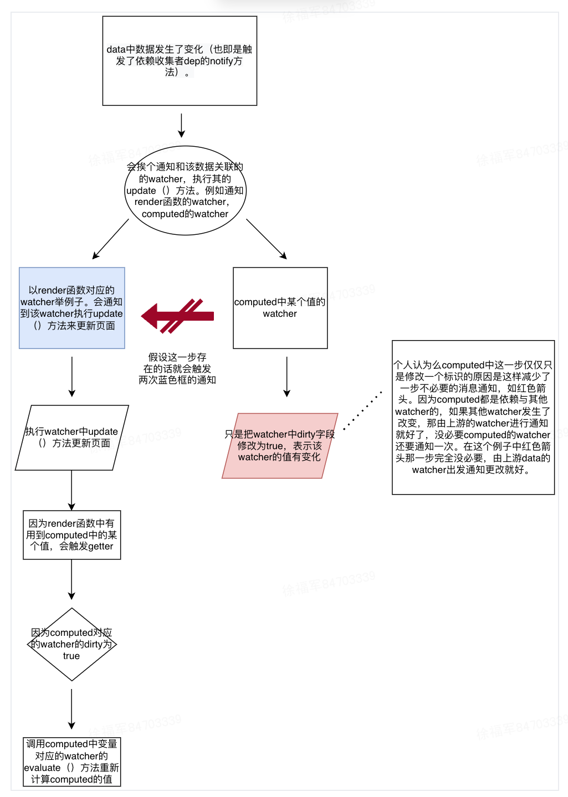

# computed



  

> computed的getter

```
 function computedGetter () {
    const watcher = this._computedWatchers && this._computedWatchers[key]
    if (watcher) {
      if (watcher.dirty) {
        watcher.evaluate()
      }
      if (Dep.target) {
        watcher.depend()
      }
      return watcher.value
    }
  }
```

> computed的watcher的一些方法

```
//computed的watcher的lazy在初始化时是true。 当上游的watcher发生变化时，会把dirty修改为true。只有当再次读取给computed的值触发getter时才会重新计算出正确的值出来。
{
  update () {
    /* istanbul ignore else */
    if (this.lazy) {
      this.dirty = true
    } else if (this.sync) {
      this.run()
    } else {
      queueWatcher(this)
    }
  },
  evaluate () {
    this.value = this.get()
    this.dirty = false
  }
}

```

# watch

watch也是直接使用的Watcher来实现的。和computed不同的是watch在代码中定义时是定义了一个回调函数, 当上游数据变化时会触发回调函数。而computed定义的是一个getter，上游变化时只是翻转computed所对应的watcher的状态。等真正需要用到computed的value时才会调用getter去计算出正确结果。

```
//xx.vue
{
  watch:{
    age:function cb(){
      
    }
  }
}
```

```
const watcher = new Watcher(vm, 'age', cb, {user:true})
```

```
//Watcher 中触发watch回调函数的逻辑
 run () {
    if (this.active) {
      const value = this.get()
      if (
        value !== this.value ||
        // Deep watchers and watchers on Object/Arrays should fire even
        // when the value is the same, because the value may
        // have mutated.
        isObject(value) ||
        this.deep
      ) {
        // set new value
        const oldValue = this.value
        this.value = value
        if (this.user) {
          try {
            this.cb.call(this.vm, value, oldValue)
          } catch (e) {
            handleError(e, this.vm, `callback for watcher "${this.expression}"`)
          }
        } else {
          this.cb.call(this.vm, value, oldValue)
        }
      }
    }
  }
```
